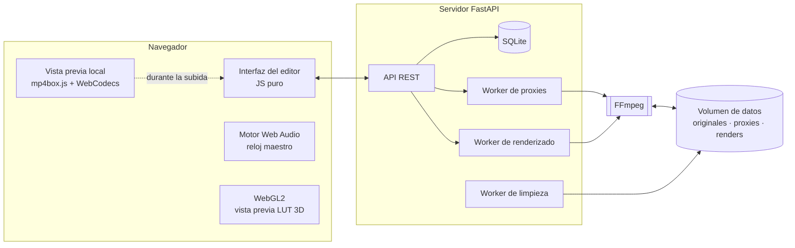

<div align="center">

# Video Tools

[English](README.md) · **Español**

**Editor de vídeo autoalojado que funciona en el navegador, impulsado por FFmpeg.**
Corta, corrige el color, mezcla audio y exporta en cualquier formato — con vista previa instantánea en el navegador y renderizado a máxima calidad en tu propio servidor.


[](https://github.com/David-Raffo/videotools/actions/workflows/ci.yml)


<picture>
  <source media="(prefers-color-scheme: dark)" srcset="docs/img/editor-dark.jpg">
  
</picture>

</div>

---

## Descripción general

Video Tools es una suite completa de edición de vídeo que se ejecuta en un servidor doméstico y se usa desde cualquier navegador. Los archivos originales nunca salen del servidor: el navegador trabaja con un proxy ligero para que la edición sea fluida, y la exportación final siempre se renderiza a partir del original intacto con FFmpeg a máxima calidad.

Nació para sustituir a un editor de escritorio en el trabajo diario — sobre todo con metraje de dron — sin instalar nada en el cliente, y para aprovechar la CPU/GPU del servidor al renderizar mientras el portátil queda libre.

## Funcionalidades

### Edición
- **Línea de tiempo multipista** organizada en tiempo de salida, con regla, miniaturas por clip y un único cabezal de reproducción para todas las pistas.
- **Cortar, recortar y borrado con cierre de huecos (ripple delete)** — selecciona un clip y pulsa <kbd>Supr</kbd>; el resto de la secuencia se desplaza para cerrar el hueco. Cortar dos veces en el mismo punto se rechaza en lugar de crear clips vacíos.
- **Cambios de velocidad** por clip (0,25× – 16×) con vista previa de audio que conserva el tono y tres modos de cámara lenta al exportar: duplicación de fotogramas, fundido o interpolación de movimiento.
- **Deshacer / rehacer** (200 pasos) y guardado automático del proyecto.

### Audio
- **Pista de audio original** con envolvente de volumen arrastrable, cortes de audio independientes y silenciado por regiones.
- **Varias pistas de música / voz**: arrastra clips, recorta bordes, ajuste magnético a cortes y al cabezal, volumen y fundidos por clip y asignación automática de carriles.
- Selección de pista de audio para fuentes con varias pistas, volumen global y fundidos.

### Color
- Looks integrados más **LUT `.cube` personalizados** (1D y 3D, de cualquier tamaño).
- Exposición, contraste, altas luces, sombras, saturación, temperatura, tinte, intensidad del LUT y enfoque.
- Todos los ajustes se combinan en un único LUT de 33³ que FFmpeg aplica con **interpolación tetraédrica en RGB de 16 bits**.
- **Comparación antes/después** renderizada por el servidor y **vista previa opcional en tiempo real con WebGL2** en el reproductor.

### Exportación
- MP4 (H.264 / H.265 / AV1), WebM (VP9), MKV, GIF, MP3 o copia de flujo sin pérdida.
- **Calidad (CRF) o tamaño de archivo objetivo** (codificación en dos pasadas), presets del codificador y salida de 10 bits.
- **Codificación/decodificación por hardware VAAPI** cuando hay GPU disponible, con vuelta automática a CPU.
- **Mapeo de tonos HDR → SDR** (PQ y HLG) con `zscale` + Hable.
- Conversión de resolución y fotogramas por segundo, recorte con proporciones predefinidas, rotación, volteo y fundidos de entrada/salida.
- **Subtítulos**: incrustados en la imagen (SRT, ASS, VTT, PGS, DVD) o como pista seleccionable.
- Cola de renderizado con progreso en directo, tiempo restante y velocidad; los renderizados continúan aunque se cierre la pestaña.

### Flujo de trabajo
- **Subidas por fragmentos reanudables** para archivos de decenas de GB.
- **Vista previa local instantánea durante la subida**: el navegador reproduce el archivo local, extrae su audio y miniaturas y permite empezar a editar antes de que termine la subida.
- **Edición rápida de dron**: suelta varios vídeos, indica cuánto recortar al principio y al final de cada uno, y se suben y renderizan uno tras otro con un preset fijo. No se crea proyecto y los originales se eliminan una vez renderizados.
- Importación directa desde carpetas del servidor, protección con contraseña y limpieza automática tras un periodo de retención configurable.

<table>
  <tr>
    <td width="50%"><p align="center"><sub>Línea de tiempo: clips a velocidad 2×, una región de audio atenuada y una pista de música con fundidos</sub></p></td>
    <td width="50%"><p align="center"><sub>Corrección de color con comparación antes/después</sub></p></td>
  </tr>
  <tr>
    <td width="50%"><p align="center"><sub>Proyectos y ediciones rápidas</sub></p></td>
    <td width="50%"><p align="center"><sub>Edición rápida por lotes con recorte por vídeo</sub></p></td>
  </tr>
</table>

## Arquitectura



| Capa | Tecnología |
|---|---|
| Backend | Python 3.13, FastAPI, Uvicorn, SQLite, NumPy |
| Multimedia | FFmpeg 7 (libx264, libx265, SVT-AV1, libvpx-vp9, VAAPI, zscale, lut3d) |
| Frontend | HTML, CSS y JavaScript puro — sin framework ni paso de compilación |
| APIs del navegador | Web Audio, WebGL2, WebCodecs, Canvas |
| Despliegue | Docker / Docker Compose detrás de un proxy inverso con TLS |

## Cómo funciona

**Edición basada en proxies.** Al subir un vídeo, un worker en segundo plano genera un proxy ligero H.264 a 720p (solo vídeo, GOP corto para buscar rápido), un MP3 por cada pista de audio, una forma de onda, una tira de miniaturas y un sprite para el scrubbing. El editor solo trabaja con estos archivos; el original permanece intacto hasta la exportación.

**El audio como reloj maestro.** En lugar de depender del audio del elemento `<video>`, cada pista de audio se decodifica en un `AudioBuffer` y se programa con la Web Audio API siguiendo la lista de edición, incluida la automatización de volumen y los fundidos. Los cambios de velocidad se estiran en el tiempo con una implementación WSOLA para conservar el tono. El elemento de vídeo sigue al reloj de audio y solo se corrige cuando la desviación supera los 120 ms, lo que mantiene la reproducción fluida entre cortes.

**Vista previa instantánea durante la subida.** Mientras un archivo se sube, el navegador lo reproduce directamente mediante una URL de objeto. `mp4box.js` lee el índice del contenedor y `WebCodecs` decodifica el audio en segundo plano, de modo que la forma de onda, las miniaturas y el sonido están disponibles en segundos — incluso con archivos de varios GB — antes de que el servidor haya recibido el archivo completo.

**Pipeline de color.** Cada ajuste de corrección y el LUT seleccionado (mezclado según su intensidad) se evalúan con NumPy sobre una rejilla identidad de 33×33×33 y se escriben como un único archivo `.cube`. FFmpeg lo aplica una sola vez con `lut3d` en `gbrp16le`, así que acumular ajustes no tiene coste adicional y nunca produce bandas. La misma rejilla se envía al navegador como textura de punto flotante y se aplica en un fragment shader de WebGL2 para la vista previa en tiempo real.

**Grafo de renderizado.** Cada exportación se compila en un único `filter_complex`: recorte por segmento, mapeo de tonos, recorte de imagen, rotación, escalado, LUT, enfoque, subtítulos, velocidad y conversión de fotogramas, y después concatenación; los segmentos de audio se estiran con `atempo`, las regiones de volumen se evalúan por fotograma y los clips de música se retrasan, se funden y se mezclan con `amix`.

## Primeros pasos

### Requisitos
- Docker y Docker Compose
- Opcional: una GPU Intel/AMD con VAAPI (`/dev/dri`) para codificación por hardware

### Ejecución

```bash
git clone https://github.com/David-Raffo/videotools.git
cd videotools
cp .env.example .env
docker compose up -d --build
```

Abre <http://localhost:8080> e inicia sesión con la contraseña definida en `APP_PASSWORD`.

Para activar la codificación por GPU, añade el override de GPU:

```bash
docker compose -f docker-compose.yml -f docker-compose.gpu.yml up -d --build
```

`RENDER_GID` y `VIDEO_GID` deben coincidir con los grupos `render` y `video` del host (`getent group render video`).

### Configuración

| Variable | Valor por defecto | Descripción |
|---|---|---|
| `APP_PASSWORD` | *(vacío)* | Contraseña de acceso a la app. Déjala vacía para desactivar la autenticación. |
| `RETENTION_DAYS` | `0` | Elimina proyectos y renders que no se hayan tocado en este número de días (`0` los conserva siempre). |
| `MAX_UPLOAD_GB` | `20` | Tamaño máximo de subida. |
| `NICE` | `10` | Prioridad de CPU de los procesos de FFmpeg, para que los renders no acaparen otros servicios. |
| `HW_DECODE` | `0` | Usa VAAPI también para decodificar, además de codificar. |
| `LIBRARY_ROOTS` | *(vacío)* | Carpetas del servidor desde las que importar, como `Nombre=/ruta;Otra=/ruta`. Móntalas en el contenedor. |
| `PORT` / `BIND` | `8080` / `127.0.0.1` | Puerto e interfaz publicados. |
| `PUID` / `PGID` | `1000` | Usuario y grupo con los que se ejecuta el contenedor. |

### Proxy inverso

La app está pensada para funcionar detrás de un proxy inverso con TLS (Caddy, Nginx, lighttpd…). Permite cuerpos de petición grandes para las subidas (el cliente envía fragmentos de 16 MB) y asegúrate de que el proxy no reescriba las respuestas en streaming: un modo de streaming de respuestas demasiado agresivo en algunos proxies puede corromper respuestas multimedia grandes para clientes lentos.

## API

El frontend se comunica con una pequeña API JSON. Endpoints principales:

| Método | Endpoint | Función |
|---|---|---|
| `POST` | `/api/uploads` | Iniciar una subida reanudable |
| `PUT` | `/api/uploads/{id}?offset=` | Subir un fragmento |
| `POST` | `/api/uploads/{id}/complete` | Finalizar, analizar y registrar el archivo |
| `GET` | `/api/media/{id}/preview` | Vídeo proxy para el editor |
| `GET` | `/api/media/{id}/audio/{track}` | Pista de audio proxy |
| `POST` | `/api/media/{id}/frame` | Renderizar un fotograma con los ajustes actuales |
| `POST` | `/api/media/{id}/estimate` | Estimar el tamaño del archivo de salida |
| `POST` | `/api/media/{id}/music` | Añadir un archivo de audio a la biblioteca del proyecto |
| `GET` `POST` `PUT` | `/api/projects` | Listar, crear y guardar proyectos |
| `POST` | `/api/jobs` | Encolar un renderizado |
| `GET` | `/api/jobs/{id}/file` | Descargar un renderizado terminado |
| `POST` | `/api/grade/lut3d` | LUT 3D combinado para la vista previa WebGL |
| `GET` `POST` `DELETE` | `/api/luts` | Gestionar LUT personalizados |

## Estructura del proyecto

```
videotools/
├── app/
│   ├── main.py        # API, workers, subidas, proyectos y cola de renderizado
│   ├── ff.py          # Análisis con FFmpeg y construcción de comandos/grafos de filtros
│   └── grade.py       # Corrección de color, lectura de .cube y generación de LUT
├── static/
│   ├── index.html
│   ├── style.css
│   ├── app.js         # Editor, línea de tiempo, motor de audio, vista previa WebGL
│   └── mp4box.min.js  # Parser MP4 de terceros (BSD-3-Clause)
├── docs/img/          # Capturas de pantalla
├── Dockerfile
├── docker-compose.yml
└── docker-compose.gpu.yml
```

## Contribuir

Las contribuciones son bienvenidas. Lee [CONTRIBUTING.md](CONTRIBUTING.md) antes de abrir un pull request y reporta los problemas de seguridad como se indica en [SECURITY.md](SECURITY.md). Las notas de versión se recogen en [CHANGELOG.md](CHANGELOG.md).

## Licencia

Publicado bajo la [Licencia MIT](LICENSE).
Incluye [mp4box.js](https://github.com/gpac/mp4box.js) de GPAC, con licencia BSD 3-Clause.

<div align="center"><sub>Creado por <a href="https://github.com/David-Raffo">David Raffo</a></sub></div>
