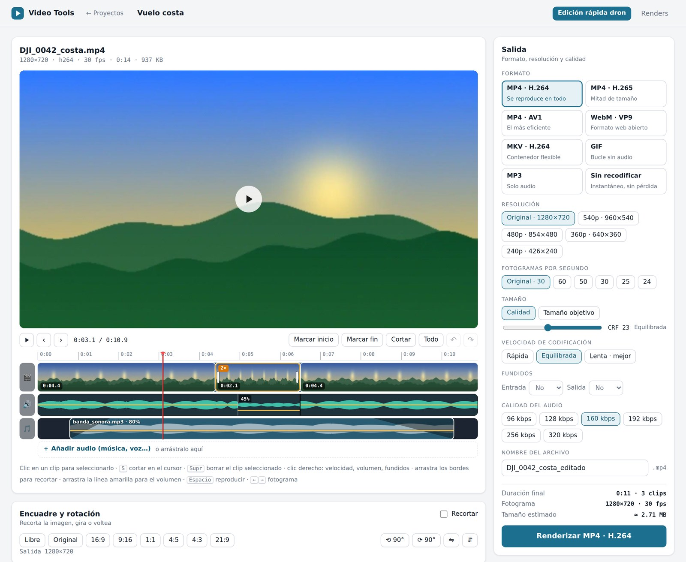
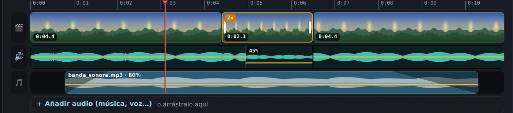
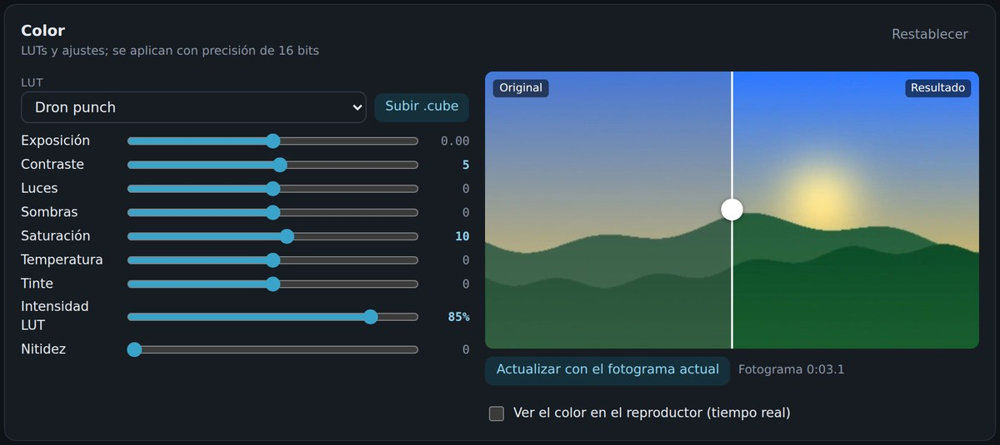
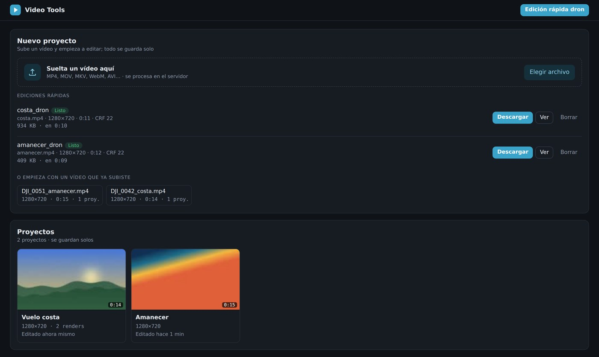
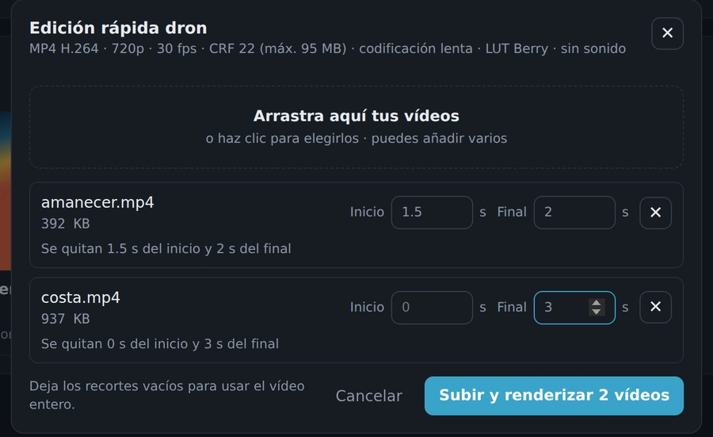
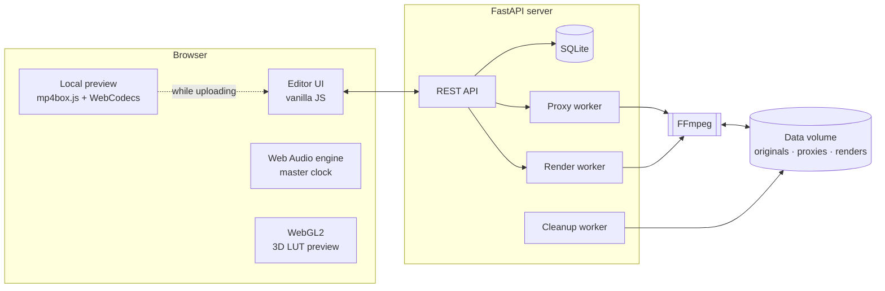

<div align="center">

# Video Tools

**A self-hosted, browser-based video editor powered by FFmpeg.**
Cut, color-grade, mix audio and export in any format — with instant preview in the browser and full-quality rendering on your own server.


[](https://github.com/David-Raffo/videotools/actions/workflows/ci.yml)


<picture>
  <source media="(prefers-color-scheme: dark)" srcset="docs/img/editor-dark.jpg">
  
</picture>

</div>

---

## Overview

Video Tools is a full video editing suite that runs on a home server and is used from any browser. The original files never leave the server: the browser works with a lightweight proxy for a fluid editing experience, and the final export is always rendered from the untouched original with FFmpeg at maximum quality.

It was built to replace a desktop editor for everyday work — mostly drone footage — without installing anything on the client, and to take advantage of the server's CPU/GPU for rendering while the laptop stays free.

> The user interface is in Spanish.

## Features

### Editing
- **Multi-track timeline** laid out in output time, with a ruler, thumbnails per clip and a single playhead across all tracks.
- **Split, trim and ripple delete** — select a clip and press <kbd>Del</kbd>; the rest of the sequence closes the gap. Splitting twice at the same point is rejected instead of creating empty clips.
- **Speed changes** per clip (0.25× – 16×) with pitch-preserving audio preview and three slow-motion modes on export: frame duplication, blending or motion interpolation.
- **Undo / redo** (200 steps) and automatic project saving.

### Audio
- **Original audio lane** with draggable volume envelope, independent audio cuts and per-region mute.
- **Multiple music / voice tracks**: drag clips, trim edges, snap to cuts and the playhead, per-clip volume and fades, automatic lane allocation.
- Audio track selection for multi-track sources, global volume and fades.

### Color
- Built-in looks plus **custom `.cube` LUTs** (1D and 3D, any size).
- Exposure, contrast, highlights, shadows, saturation, temperature, tint, LUT intensity and sharpening.
- All adjustments are baked into a single 33³ LUT and applied by FFmpeg with **tetrahedral interpolation in 16-bit RGB**.
- **Before/after frame comparison** rendered by the server, and an optional **real-time WebGL2 preview** in the player.

### Export
- MP4 (H.264 / H.265 / AV1), WebM (VP9), MKV, GIF, MP3, or lossless stream copy.
- **Quality (CRF) or target file size** (two-pass encoding), encoder presets, 10-bit output.
- **VAAPI hardware encoding/decoding** when a GPU is available, with automatic CPU fallback.
- **HDR → SDR tone mapping** (PQ and HLG) with `zscale` + Hable.
- Resolution and frame-rate conversion, crop with aspect presets, rotation and flips, fade in/out.
- **Subtitles**: burn-in (SRT, ASS, VTT, PGS, DVD) or embedded as a selectable track.
- Render queue with live progress, ETA and speed; renders keep running if the tab is closed.

### Workflow
- **Resumable chunked uploads** for files up to tens of GB.
- **Instant local preview while uploading**: the browser plays the local file, extracts its audio and thumbnails, and lets you start editing before the upload finishes.
- **Quick drone edit**: drop several videos, set how much to trim from the start and end of each one, and they are uploaded and rendered one after another with a fixed preset. No project is created and the originals are deleted once rendered.
- Import directly from folders on the server, password protection and automatic cleanup after a configurable retention period.

<table>
  <tr>
    <td width="50%"><p align="center"><sub>Timeline: clips at 2× speed, a lowered audio region and a music track with fades</sub></p></td>
    <td width="50%"><p align="center"><sub>Color grading with before/after comparison</sub></p></td>
  </tr>
  <tr>
    <td width="50%"><p align="center"><sub>Projects and quick edits</sub></p></td>
    <td width="50%"><p align="center"><sub>Batch quick edit with per-video trimming</sub></p></td>
  </tr>
</table>

## Architecture



| Layer | Technology |
|---|---|
| Backend | Python 3.13, FastAPI, Uvicorn, SQLite, NumPy |
| Media | FFmpeg 7 (libx264, libx265, SVT-AV1, libvpx-vp9, VAAPI, zscale, lut3d) |
| Frontend | HTML, CSS and vanilla JavaScript — no framework, no build step |
| Browser APIs | Web Audio, WebGL2, WebCodecs, Canvas |
| Deployment | Docker / Docker Compose behind a TLS reverse proxy |

## How it works

**Proxy-based editing.** When a video is uploaded, a background worker creates a lightweight 720p H.264 proxy (video only, short GOP for fast seeking), one MP3 per audio track, a waveform, a thumbnail strip and a scrubbing sprite. The editor only ever touches these files; the original stays untouched until export.

**Audio as the master clock.** Instead of relying on the `<video>` element's audio, each audio track is decoded into an `AudioBuffer` and scheduled with the Web Audio API following the edit list, including volume automation and fades. Speed changes are time-stretched with a WSOLA implementation so pitch is preserved. The video element follows the audio clock and is corrected only when drift exceeds 120 ms, which keeps playback smooth across cuts.

**Instant preview during upload.** While a file is uploading, the browser plays it directly through an object URL. `mp4box.js` reads the container index and `WebCodecs` decodes the audio in the background, so waveform, thumbnails and sound are available within seconds — even for multi-GB files — before the server has received the whole file.

**Color pipeline.** Every grading adjustment and the selected LUT (blended by intensity) are evaluated with NumPy on a 33×33×33 identity grid and written as a single `.cube` file. FFmpeg applies it once with `lut3d` in `gbrp16le`, so stacking adjustments costs nothing extra and never bands. The same grid is sent to the browser as a float texture and applied in a WebGL2 fragment shader for the real-time preview.

**Render graph.** Each export is compiled into a single `filter_complex`: per-segment trim, tone mapping, crop, rotation, scaling, LUT, sharpening, subtitles, speed and frame-rate conversion, then concatenation; audio segments are time-stretched with `atempo`, volume regions are evaluated per frame, and music clips are delayed, faded and mixed with `amix`.

## Getting started

### Requirements
- Docker and Docker Compose
- Optional: an Intel/AMD GPU with VAAPI (`/dev/dri`) for hardware encoding

### Run

```bash
git clone https://github.com/David-Raffo/videotools.git
cd videotools
cp .env.example .env
docker compose up -d --build
```

Open <http://localhost:8080> and log in with the password set in `APP_PASSWORD`.

To enable GPU encoding, add the GPU override:

```bash
docker compose -f docker-compose.yml -f docker-compose.gpu.yml up -d --build
```

`RENDER_GID` and `VIDEO_GID` must match the `render` and `video` groups on the host (`getent group render video`).

### Configuration

| Variable | Default | Description |
|---|---|---|
| `APP_PASSWORD` | *(empty)* | Password to access the app. Leave empty to disable authentication. |
| `RETENTION_DAYS` | `0` | Delete projects and renders not touched for this many days (`0` keeps them forever). |
| `MAX_UPLOAD_GB` | `20` | Maximum upload size. |
| `NICE` | `10` | CPU priority for FFmpeg processes, so renders don't starve other services. |
| `HW_DECODE` | `0` | Use VAAPI for decoding as well as encoding. |
| `LIBRARY_ROOTS` | *(empty)* | Server folders to import from, as `Name=/path;Other=/path`. Mount them into the container. |
| `PORT` / `BIND` | `8080` / `127.0.0.1` | Published port and interface. |
| `PUID` / `PGID` | `1000` | User and group the container runs as. |

### Reverse proxy

The app is designed to sit behind a TLS reverse proxy (Caddy, Nginx, lighttpd…). Allow large request bodies for uploads (the client sends 16 MB chunks) and make sure the proxy does not rewrite streamed responses: an aggressive response-streaming mode in some proxies can corrupt large media responses for slow clients.

## API

The frontend talks to a small JSON API. Main endpoints:

| Method | Endpoint | Purpose |
|---|---|---|
| `POST` | `/api/uploads` | Start a resumable upload |
| `PUT` | `/api/uploads/{id}?offset=` | Upload a chunk |
| `POST` | `/api/uploads/{id}/complete` | Finish, probe and register the media |
| `GET` | `/api/media/{id}/preview` | Proxy video for the editor |
| `GET` | `/api/media/{id}/audio/{track}` | Proxy audio track |
| `POST` | `/api/media/{id}/frame` | Render a single frame with the current settings |
| `POST` | `/api/media/{id}/estimate` | Estimate the output file size |
| `POST` | `/api/media/{id}/music` | Add an audio file to the project library |
| `GET` `POST` `PUT` | `/api/projects` | List, create and save projects |
| `POST` | `/api/jobs` | Queue a render |
| `GET` | `/api/jobs/{id}/file` | Download a finished render |
| `POST` | `/api/grade/lut3d` | Baked 3D LUT for the live WebGL preview |
| `GET` `POST` `DELETE` | `/api/luts` | Manage custom LUTs |

## Project structure

```
videotools/
├── app/
│   ├── main.py        # API, workers, uploads, projects and render queue
│   ├── ff.py          # FFmpeg probing and command/filter graph builders
│   └── grade.py       # Color grading, .cube parsing and LUT baking
├── static/
│   ├── index.html
│   ├── style.css
│   ├── app.js         # Editor, timeline, audio engine, WebGL preview
│   └── mp4box.min.js  # Third-party MP4 parser (BSD-3-Clause)
├── docs/img/          # Screenshots
├── Dockerfile
├── docker-compose.yml
└── docker-compose.gpu.yml
```

## Contributing

Contributions are welcome. Read [CONTRIBUTING.md](CONTRIBUTING.md) before opening a pull request, and report security issues as described in [SECURITY.md](SECURITY.md). Release notes are kept in [CHANGELOG.md](CHANGELOG.md).

## License

Released under the [MIT License](LICENSE).
Includes [mp4box.js](https://github.com/gpac/mp4box.js) by GPAC, licensed under the BSD 3-Clause License.

<div align="center"><sub>Built by <a href="https://github.com/David-Raffo">David Raffo</a></sub></div>
